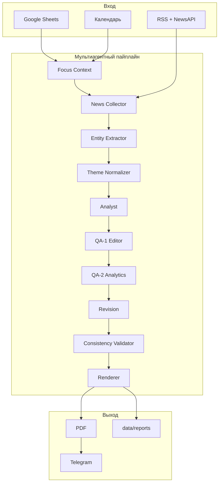

# ETF Daily Briefing

Ежедневный торговый брифинг по ETF-портфелю: **новости вчера** + **календарь сегодня**, с доставкой в Telegram **только как PDF**.

## Что делает сервис

1. **Читает Google Таблицу** — листы `Portfel` и `Watchlist`: позиции ETF, объёмы, зона наблюдения.
2. **Загружает структуру ETF** — топ-бумаги, отрасли (JustETF / Investing.com, с кэшем).
3. **Собирает новости за вчера** (Europe/Warsaw):
   - RSS (Reuters, Yahoo Finance, Investing.com);
   - обязательный скрининг по **отраслям интереса** (портфель + watchlist);
   - обязательный скрининг по **компаниям** портфеля и watchlist (NewsAPI);
   - дополнительная зона поиска: **геополитические ожидания** (`config/settings.yaml`).
4. **Загружает экономический календарь** на сегодня (Investing.com).
5. **Формирует брифинг** через **мультиагентный пайплайн** OpenAI (см. ниже).
6. **Сохраняет** Markdown + HTML + PDF в `data/reports/` и отправляет **PDF** в Telegram.

## Мультиагентный пайплайн

```
Обработчик первичных данных (портфель, структура, зоны интереса)
        ↓
News Collector          — сбор, дедупликация, фильтр по времени
        ↓
Entity Extractor        — компании, ETF, страны, сырьё, события
        ↓
Theme Normalizer        — отрасли, GICS, темы (словарь data/generated/themes.yaml)
        ↓
Analyst                 — черновик отчёта (§1–§4)
        ↓
QA-1 Редактор           — грамматика, терминология, стиль
        ↓
QA-2 Аналитика          — логика, причинность, соответствие новостям
        ↓
Revision Agent          — вносит замечания QA без смены структуры
        ↓
Consistency Validator   — техническая проверка JSON/таблиц
        ↓
Renderer                — Markdown, HTML, PDF
```

Промпты агентов: `prompts/` (отдельный файл на роль). Чекпоинты этапов: `data/pipeline/<run_id>/`.

**Техдок:** постобработка §1–§3, словари отраслей, раскраска PDF — [`docs/TECHNICAL.md`](docs/TECHNICAL.md).

Оркестратор: `src/pipeline/orchestrator.py`. Настройки моделей: `config/settings.yaml` → блок `pipeline`.

## Единая шкала «Влияние» (−5…+5)

Во всех таблицах с числовой оценкой используется **одна шкала**:

| Значение | Смысл |
|----------|--------|
| **±1** | Локальная новость, отдельные компании |
| **±2** | Одна отрасль, эффект 1–3 дня |
| **±3** | Несколько отраслей, эффект до нескольких недель |
| **±4** | Широкий рынок, меняет ожидания инвесторов |
| **±5** | Системное событие, меняет макрокартину |
| **0** | Нет влияния |

Порядковый номер строки во всех таблицах — колонка **`#`** (не «№»).

## Структура отчёта

Шаблон: `templates/template.md`.

| Раздел | Содержание |
|--------|------------|
| **Резюме** | Тон дня, главный драйвер |
| **§1 Топ новости** | `#` · Событие · **Влияние** · Сектор · Драйвер сектора |
| **§2 Рейтинг отраслей** | `#` · Отрасль · Влияние · Обоснование |
| **§3 Компании** | Бумаги портфеля и watchlist, влияние −5…+5 |
| **§4 Календарь** | События сегодня, влияние −5…+5 |

**PDF §1:** колонки `#` / `Событие` / `Влияние` — цвет по знаку влияния события; `Сектор` / `Драйвер` — цвет по вектору давления на отрасль (парсер RU+EN). Подробно: [`docs/TECHNICAL.md`](docs/TECHNICAL.md).

Постобработка таблиц §2–§3 (дедуп, канонизация имён) — в **Consistency Validator**, см. тот же документ.

## Telegram-бот

| Режим | Когда | Действие |
|-------|-------|----------|
| **Авто** | Каждый день в 09:00 | В чат приходит **только PDF** |
| **По запросу** | В любое время | Кнопка **Daily briefing** или `/report` |

**Поведение при генерации:** сразу после `/report` или кнопки — короткое подтверждение запуска; если сервис уже занят — отдельное сообщение. Успех — файл PDF. Ошибка — сообщение с **причиной** (например, `PDF не сформирован`, ошибка OpenAI).

Команды: `/start`, `/report`, `/status`, `/portfolio`.

### Интеграция с Project_3_bot

Сервис подключается к основному боту как функция `daily_briefing`:

- кнопка **Daily briefing** в меню `/start`;
- планировщик утреннего отчёта в 09:00;
- ручной запуск в любое время через ту же кнопку.

На сервере код клонируется в `/opt/telegram-bot/briefing-src`, в контейнере бота — `DAILY_BRIEFING_ROOT=/app/briefing`.

Код монтируется read-only; для отчётов и кэша нужен **writable** volume:

```env
DAILY_BRIEFING_DATA_DIR=/app/data
```

В `docker-compose` основного бота: `briefing-data:/app/data`.

## Быстрый старт (локально)

```bash
python -m venv .venv
.venv\Scripts\activate          # Windows
pip install -r requirements.txt
copy .env.example .env          # заполнить переменные
python check_openai.py
python run_manual.py            # полный пайплайн без бота (10 этапов в логе)
python -m src.main              # автономный Telegram-бот
python -m pytest tests/ -q      # тесты валидатора и шкалы влияния
python verify_pdf_layout.py     # пересборка preview PDF из example.md
```

## Переменные окружения (.env)

| Переменная | Описание |
|------------|----------|
| `TELEGRAM_BOT_TOKEN` | Токен бота (для `python -m src.main`) |
| `TELEGRAM_CHAT_ID` | ID чата для доставки отчётов |
| `GOOGLE_SHEETS_ID` | ID Google Таблицы |
| `GOOGLE_CREDENTIALS_PATH` | Путь к JSON service account |
| `OPENAI_API_KEY` | Ключ OpenAI |
| `OPENAI_MODEL` | Модель по умолчанию для всех агентов |
| `NEWSAPI_KEY` | NewsAPI для скрининга компаний/отраслей |
| `TIMEZONE` | Часовой пояс (по умолчанию `Europe/Warsaw`) |
| `DAILY_BRIEFING_HOUR` / `MINUTE` | Время автоотчёта (9:00) |
| `DAILY_BRIEFING_ROOT` | Корень кода в контейнере (`/app/briefing`) |
| `DAILY_BRIEFING_DATA_DIR` | Writable каталог для отчётов и кэша (`/app/data`) |

## Архитектура

```
src/
  main.py                      # автономный Telegram-бот
  config.py
  bot/
    handlers.py                # команды, доставка PDF
    scheduler.py               # cron 09:00
  pipeline/
    orchestrator.py            # мультиагентный пайплайн
    models.py                  # артефакты между этапами
    stages/                    # focus, news, extract, normalize, analyst, QA, render
  agents/
    base.py                    # обёртка OpenAI (JSON)
  data/sheets.py               # Google Sheets
  structure/                   # состав ETF, отрасли, кэш
  sectors/interest.py          # отрасли интереса
  news/aggregator.py           # RSS + NewsAPI
  calendar/investing.py        # экономический календарь
  report/
    generator.py               # точка входа генерации
    storage.py                 # md / html / pdf
    pdf.py                     # Markdown → PDF
    impact_scale.py            # шкала −5…+5
prompts/                       # промпты агентов (analyst, qa_editor, …)
templates/
  template.md                  # форма итогового отчёта
  example.md                   # пример для preview PDF
config/settings.yaml           # RSS, лимиты, pipeline, extra_search_terms
data/
  reports/                     # архив брифингов
  pipeline/                    # чекпоинты этапов
  generated/themes.yaml        # база инвестиционных тем
tests/                         # consistency, impact_scale, pdf sentiment, sector/portfolio dedup
docs/
  TECHNICAL.md                 # постобработка, дедуп, раскраска §1 PDF
```

## Пайплайн (схема)



## Деплой на VPS (автономный сервис)

```bash
git clone git@github.com:DenisVoytulevich/Project_3_etf_yesterdays_news.git /opt/etf-daily-briefing
cd /opt/etf-daily-briefing
cp .env.example .env   # заполнить
docker compose -f vps/docker-compose.yml up -d --build
```

Логи: `docker compose -f vps/docker-compose.yml logs -f`

## Google Cloud

1. Создайте Service Account с доступом к Google Sheets API.
2. JSON-ключ → `credentials/google_service_account.json`.
3. Email аккаунта добавьте «Читатель» в таблицу.

Файлы `credentials/` и `.env` **не коммитятся** в git.
