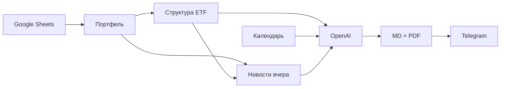

# ETF Daily Briefing

Ежедневный торговый брифинг по ETF-портфелю: **новости вчера** + **календарь сегодня**, с доставкой в Telegram.

## Что делает сервис

1. **Читает Google Таблицу** — листы `Portfel` и `Watchlist`: позиции ETF, объёмы, зона наблюдения.
2. **Загружает структуру ETF** — топ-бумаги, отрасли (JustETF / Investing.com, с кэшем).
3. **Собирает новости за вчера** (Europe/Warsaw):
   - RSS (Reuters, Yahoo Finance, Investing.com);
   - обязательный скрининг по **отраслям интереса** (портфель + watchlist);
   - обязательный скрининг по **компаниям** портфеля и watchlist (NewsAPI).
4. **Загружает экономический календарь** на сегодня (Investing.com).
5. **Формирует брифинг** через OpenAI по шаблону `templates/template.md` и промпту `templates/prompt.md`.
6. **Сохраняет** markdown + PDF в `data/reports/` и отправляет в Telegram.

## Telegram-бот

| Режим | Когда | Действие |
|-------|-------|----------|
| **Авто** | Каждый день в 09:00 | Брифинг приходит в чат |
| **Внеурочное** | Будни с 19:00, выходные, до 09:00 | Кнопка «📊 Брифинг вне расписания» или `/report` |
| **Рабочее время** | Будни 09:00–19:00 | Ручной запуск недоступен (уже был утренний автоотчёт) |

Команды: `/start`, `/report`, `/status`, `/portfolio`.

### Интеграция с Project_3_bot

Сервис подключается к основному боту как функция `daily_briefing`:

- кнопка **Daily briefing** в меню `/start`;
- планировщик утреннего отчёта в 09:00;
- ручной запуск внеурочно через ту же кнопку.

На сервере код клонируется в `/opt/etf-daily-briefing`, в контейнере бота — `DAILY_BRIEFING_ROOT=/app/briefing`.

## Быстрый старт (локально)

```bash
python -m venv .venv
.venv\Scripts\activate          # Windows
pip install -r requirements.txt
copy .env.example .env          # заполнить переменные
python check_openai.py
python run_manual.py              # полный пайплайн без бота
python -m src.main                # автономный Telegram-бот
```

## Переменные окружения (.env)

| Переменная | Описание |
|------------|----------|
| `TELEGRAM_BOT_TOKEN` | Токен бота (для автономного режима `python -m src.main`) |
| `TELEGRAM_CHAT_ID` | ID чата для доставки отчётов |
| `GOOGLE_SHEETS_ID` | ID Google Таблицы |
| `GOOGLE_CREDENTIALS_PATH` | Путь к JSON service account |
| `OPENAI_API_KEY` | Ключ OpenAI |
| `OPENAI_MODEL` | Модель (например `gpt-5-nano`) |
| `NEWSAPI_KEY` | NewsAPI для скрининга компаний/отраслей |
| `TIMEZONE` | Часовой пояс (по умолчанию `Europe/Warsaw`) |
| `DAILY_BRIEFING_HOUR` / `MINUTE` | Время автоотчёта (9:00) |
| `OFF_HOURS_WEEKDAY_START` | Начало внеурочного окна (19:00) |
| `OFF_HOURS_WEEKDAY_END` | Конец внеурочного окна (09:00) |

## Структура отчёта

Шаблон в `templates/template.md`:

- **Резюме дня** — тон рынка, главный драйвер
- **§1 Топ новости** — события с влиянием на сектора
- **§2 Сектора** — рейтинги отраслей интереса (−5…+5)
- **§3 Компании** — анализ ключевых бумаг портфеля и watchlist
- **§4 Календарь** — макро- и корпоративные события на сегодня

Промпт для AI: `templates/prompt.md`. Настройки пайплайна: `config/settings.yaml`.

## Архитектура

```
src/
  main.py                 # точка входа автономного бота
  config.py               # настройки из .env
  bot/
    handlers.py           # команды, кнопка вне расписания
    scheduler.py          # cron 09:00 + проверка внеурочного времени
    keyboards.py
  data/sheets.py          # Google Sheets
  structure/              # состав ETF, отрасли, кэш
  sectors/interest.py     # отрасли интереса (Portfel + Watchlist)
  news/aggregator.py      # RSS + NewsAPI
  calendar/investing.py   # экономический календарь
  report/
    generator.py          # OpenAI + Jinja2
    storage.py            # сохранение md/pdf
    pdf.py
templates/                # форма отчёта и промпт
config/settings.yaml      # RSS, лимиты, расписание
data/reports/             # архив брифингов
```

## Пайплайн (схема)



## Деплой на VPS (автономный сервис)

```bash
git clone git@github.com:DenisVoytulevich/Project_3_etf_yesterdays_news.git /opt/etf-daily-briefing
cd /opt/etf-daily-briefing
cp .env.example .env   # заполнить
docker compose -f vps/docker-compose.yml up -d --build
```

Логи: `docker compose -f vps/docker-compose.yml logs -f`

## Google Cloud

1. Создайте Service Account с доступом к Google Sheets API.
2. JSON-ключ → `credentials/google_service_account.json`.
3. Email аккаунта добавьте «Читатель» в таблицу.

Файлы `credentials/` и `.env` **не коммитятся** в git.
